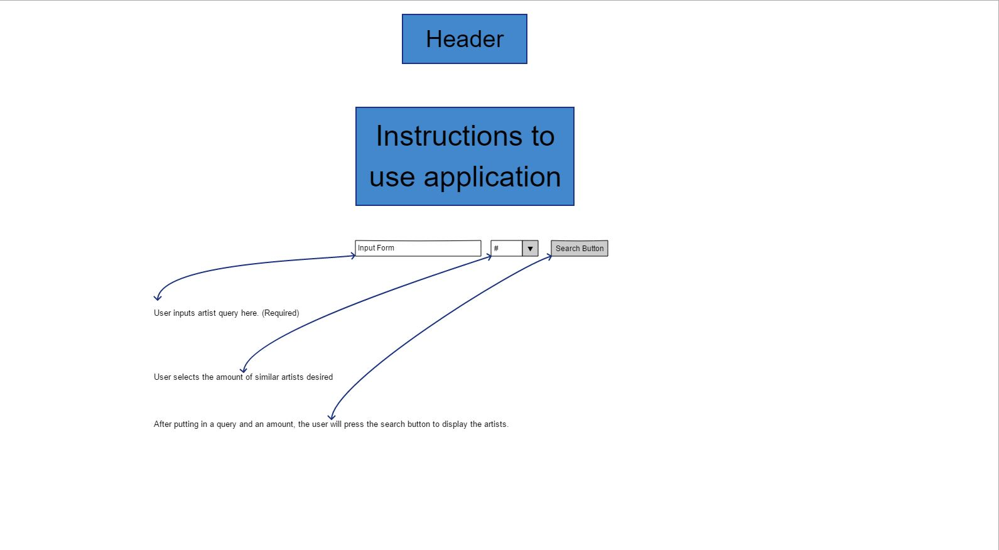

# BandWagon

Live preview: https://pillgrumm.github.io/similar-artist-search-api-capstone/

BandWagon will allow a user to find similar artists to the artist they input. Once the user receives the similar artist, they can click on the artists name and it will take them to the artists last.fm profile

## User Experience/Stories

**Landing Page**

As a user, I want to view the first page of the app and how to use it. I will also be able to click the button to move onto the search page.

**Search Page**

As a user, I will be able to input an artist, select the amount of artists I would like to see (in increments of three) and search for an artist based on the information submitted to the form.

**Results Display**

As a user, I want to view the results for the artist/amount that I have submitted into the input form. Upon clicking on the name of an artist displayed, I will be taken to their last.fm profile.

**Image Unavailable**

As a user, if an artist does not have an image to display, I will see a placeholder image that displays "No Image Available".

**Error Display**

As a user, if an error occurs, I would like to be notified.

**Different Results Display**

As a user, I will be able to simply input a new artist and receive results based on that artist.

